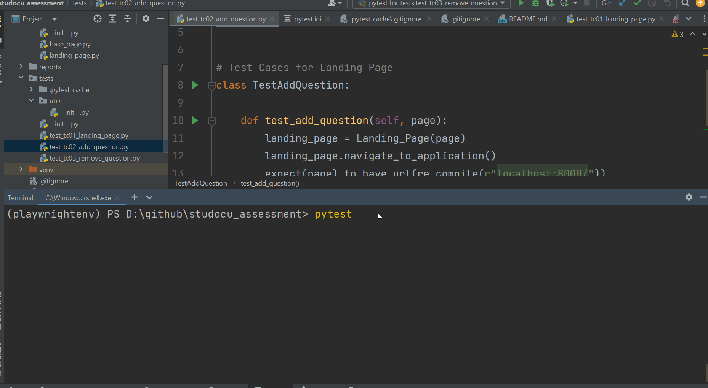
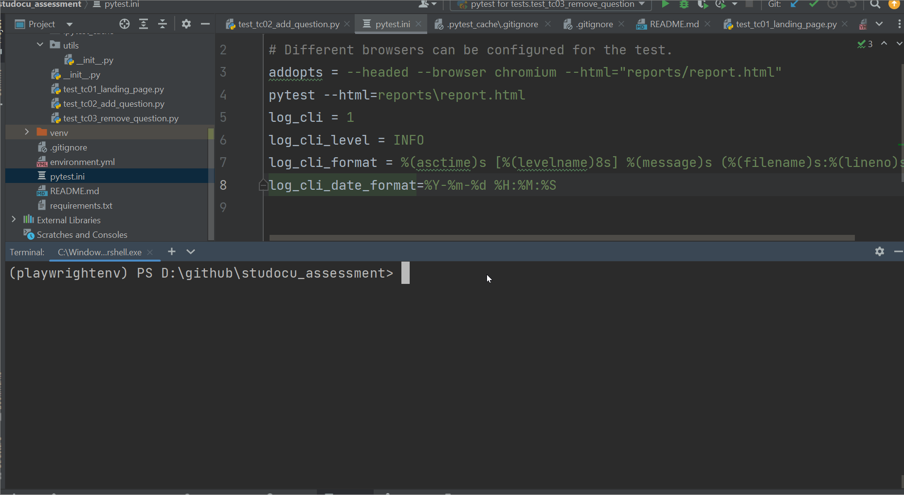

# Test Automation Framework using Playwright and Python

Studocu Automation Framework is a project aimed at automating the testing of The awesome Q/A tool website using the Playwright-Python. This framework provides a simple, yet powerful way to write and execute automated tests for the application
## Documentation

### Prerequisites
To use Studocu Automation Framework, you must have the following installed:
 - Conda package manager
 - A python server running locally The awesome Q/A tool website - https://github.com/StuDocu/qa-engineer-assignment

### Setup
1. Clone the repository: git clone https://github.com/jaikishpai/studocu-automation-framework.git

2. Navigate to the project directory: 
```bash
cd studocu-automation-framework
````

3. Create a new Conda environment by running the command:
 ```bash 
 conda env create -f environment.yml
 ```

This will create an virtual environment called `playwright_env` with the `python` and `pip` installed.

4. Activate the Conda environment:
```bash
conda activate playwright_env
```
5. Install the required packages by running the command: 
```bash
pip install -r requirements.txt
```
This will install all the dependencies like `playwright`, `pytest` etc.


## Running Tests

To run tests, run the following command:

```bash
  pytest
```
The execution time can be drastically reduced by running the tests in parallel. The dependency that lets tests to run is parallel `pytest-xdist`. To run the tests in parallel run the follow command.

```bash
pytest -n 3
```
The above command will distribute the tests across three threads and executing them in parallel

### Project Structure
```bash
├── pages
│   ├── utils
|   |     ├── create_question_and_answer.py
│   ├── base_page.py
│   ├── landing_page.py
├── reports
├── tests/
│   ├── test_tc01_landing_page.py
│   ├── test_tc02_add_question.py
│   └── test_tc03_remove_question.py
├── .gitignore
├── LICENSE.md
├── README.md
├── pytest.ini
└── requirements.txt
```
`pages`: This directory contains the Page Object Model (POM) classes for the web pages of The awesome Q/A tool website. 
Each class corresponds to a specific page of the website(in this case only one page - landing page) and contains methods 
for interacting with the page elements. The base_page.py file contains the elements which are common across the 
application, which is inherited by all other page classes and provides common functionality for navigating to pages, interacting with elements, and handling errors.

`tests`: This directory contains the test cases for The awesome Q/A tool website. Each test case is written using the 
Pytest framework and the playwright and python. The test framework used in pytest.

`.gitignore`: This file specifies the files and directories that should be ignored by Git when committing changes to the repository.

`requirements.txt`: This file specifies the Python packages and their versions that are required by the Studocu 
Automation Framework. These packages can be installed using the pip package manager.

`environment.yml`: This file specifies a virtual environment for python and list of packages to be installed in the 
environment there by allowing to isolate the project dependencies from the system.

`pytest.ini`: This file specifies configuration for pytest that allows to customize behavior of pytest and configure 
plugins.

`reports`: This directory contains the test report n html format as a result of the test run. It contains all the details of the test execution like
`passed, failed tests, execution time etc.

## Demo

test execution demo: all the tests are executed sequentially and test report is generated.



parallel test execution demo: the tests are executed in parallel and test report is generated.




##Test Cases

- `test_tc01_landing_page` - test case to verify that all the elements are present in the landing page.
- `test_tc02_add_question` - test case to add a question and verify that the question is added.
- `test_tc03_remove_question.py` - test case to remove all questions and verify that the confirmation message is returned.